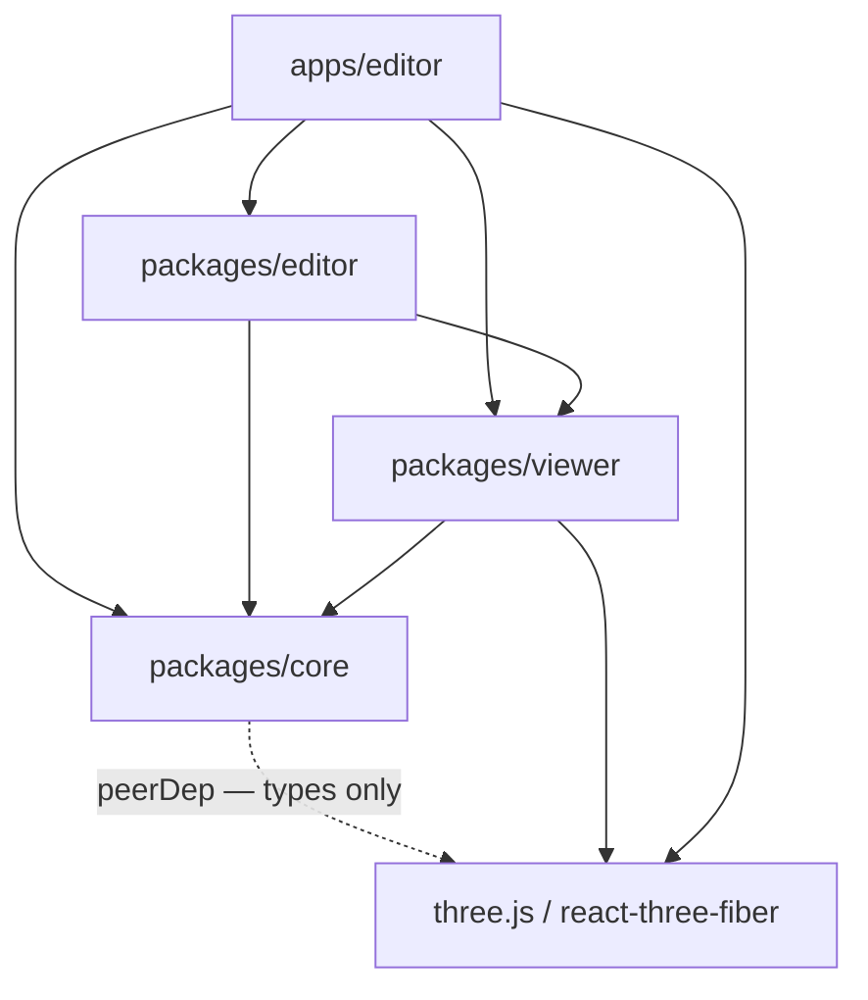
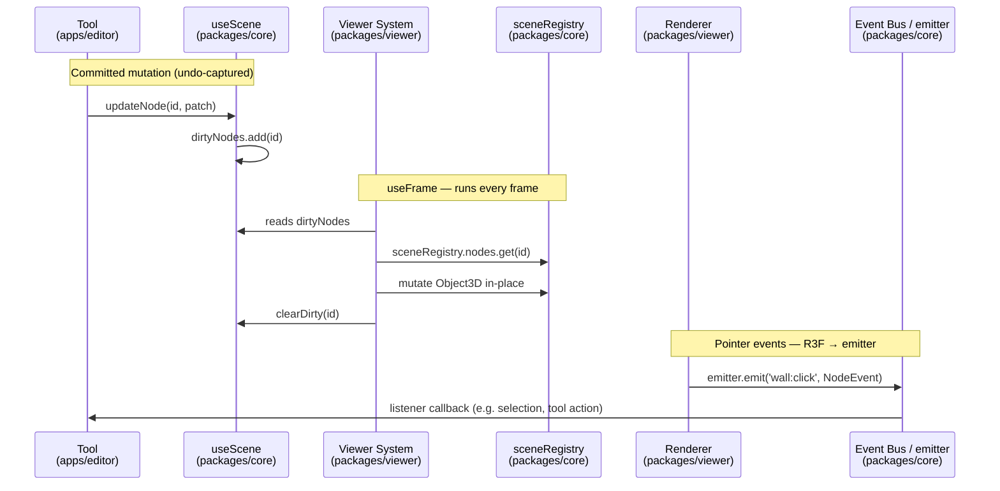
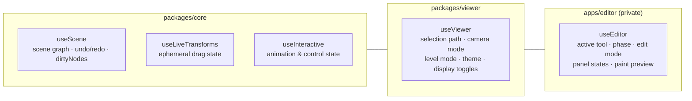

# Architecture Diagram

*Visual maps of the three-layer architecture, data-flow, and node-type lifecycle.*

Applies to: `packages/**` `apps/editor/**`

---

## Layer dependency graph

Arrows mean "imports from". `packages/core` sits at the base — consumed by every layer above it. Three.js is a peer dependency of `core` (type-only) and a real dependency of `viewer` and the editor app.

**Forbidden arrows (layer violations):**

| From | To | Rule |
|---|---|---|
| `packages/core` | `packages/viewer` | core must not know about Three.js rendering |
| `packages/viewer` | `apps/editor` | viewer must stay editor-agnostic |
| `packages/core` | `apps/editor` | same — core is a standalone library |

See `wiki/architecture/layers.md` and `wiki/architecture/viewer-isolation.md`.

---

## Data-flow — the frame loop

A single mutation travels through four stages on each animation frame.

**Key invariants:**

- Renderers only **emit**, never listen to the event bus.
- Systems only **read and mutate** scene registry; they never emit events or mutate `useScene` state.
- Tools only **write** to `useScene` (committed) or `useLiveTransforms` (ephemeral drag). They never import from `packages/viewer`.

---

## Node-type lifecycle — adding a new 3D object

Every new node type requires changes in all three layers, in this order:

```mermaid
flowchart LR
  S1["① Schema\npackages/core/src/schema/nodes/<type>.ts"]
  S2["② Register in AnyNode union\npackages/core/src/schema/types.ts"]
  S3["③ Event types\npackages/core/src/events/bus.ts"]
  S4["④ sceneRegistry.byType\npackages/core/src/hooks/scene-registry/scene-registry.ts"]
  S5["⑤ Renderer\npackages/viewer/src/components/renderers/<type>/<type>-renderer.tsx"]
  S6["⑥ Viewer System\npackages/viewer/src/systems/<type>/<type>-system.tsx"]
  S7["⑦ NodeRenderer dispatch\npackages/viewer/src/components/renderers/node-renderer.tsx"]
  S8["⑧ useNodeEvents NodeConfig\npackages/viewer/src/hooks/use-node-events.ts"]
  S9["⑨ Editor Tool (optional)\napps/editor/components/tools/<type>-tool.tsx"]

  S1 --> S2 --> S3 --> S4 --> S5 --> S6 --> S7 --> S8 --> S9
```

Use `.agents/skills/build-3d-feature/SKILL.md` for the executable step-by-step checklist.

---

## Store ownership

Three Zustand stores, one per layer. No cross-store coupling inside store actions.

**Rule:** Any state that would be needed by the read-only `/viewer` route belongs in `useViewer` or `useScene`. State that is only needed while editing belongs in `useEditor`.

---

## Three.js layer assignments

Three rendering layers control what each camera sees.

| Constant | Value | Owned by | Used for |
|---|---|---|---|
| `SCENE_LAYER` | 0 | `packages/viewer` | All regular scene geometry (walls, items, slabs…) |
| `EDITOR_LAYER` | 1 | `apps/editor` | Editor helpers, grid, tool previews, cursor sphere |
| `ZONE_LAYER` | 2 | `packages/viewer` | Semi-transparent zone fills — composited separately |

Import constants from `@pascal-app/viewer`; never hardcode layer numbers.

See `wiki/architecture/layers.md`.
